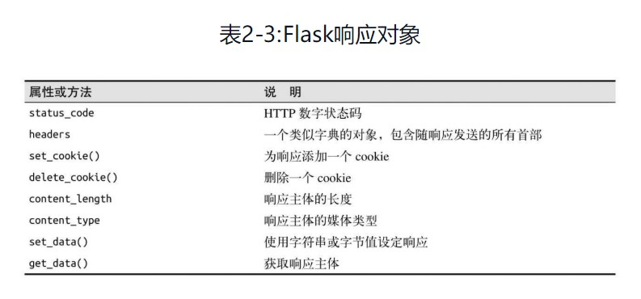

# Flask 框架学习
1. 请求钩子，hook，即将这些行为与某个函数绑定。
    ```python
    @before request #注册一个函数，在每次请求之前运行
    @before first request #注册一个函数，只在处理第一个请求之前运行。一般通过这个钩子添加服务器初始化任务。
    @after request # 注册一个函数，在没有未处理的异常抛出时，每次请求后运行
    @teardown request #即使有未处理的异常，也在每次请求之后运行
    ```
2. 在请求钩子函数和视图函数之前共享数据一般使用“上下文全局变量”`g`。例如，before request 处理程序可以从数据库中加载已登录用户，并将其保存到g.user中，随后调用视图函数时，便可以通过g.user获取用户信息。
3. Flask调用视图函数后，会将其返回值作为响应（response）的内容。
    1. HTML页面
    2. 状态码。默认为200.可以添加到响应文本后，比如`return '<h1>bad request</h1>',400`，这是返回一个400响应。
    3. Flask视图函数还可以返回一个响应对象。make_response()函数可接受1，2，3个参数，然后返回一个响应对象。比如:
        ```python
        response=make_response('<h1>bad request</h1>',400)
        reponse.set_cookie('answer','42')
        return response
        ```
4. Flask response 对象最常用的属性和方法
    
5. Flask response中有个特殊的类型：`重定向`，状态码通常是302。redirect()辅助函数也提供相同功能。
    ```python
    @app.route('/')
    def index():
        return redirect('http://www.baidu.com')
    ```
6. Flask 特殊响应类型：`错误`。abort()函数来生成,状态码404。
7. 