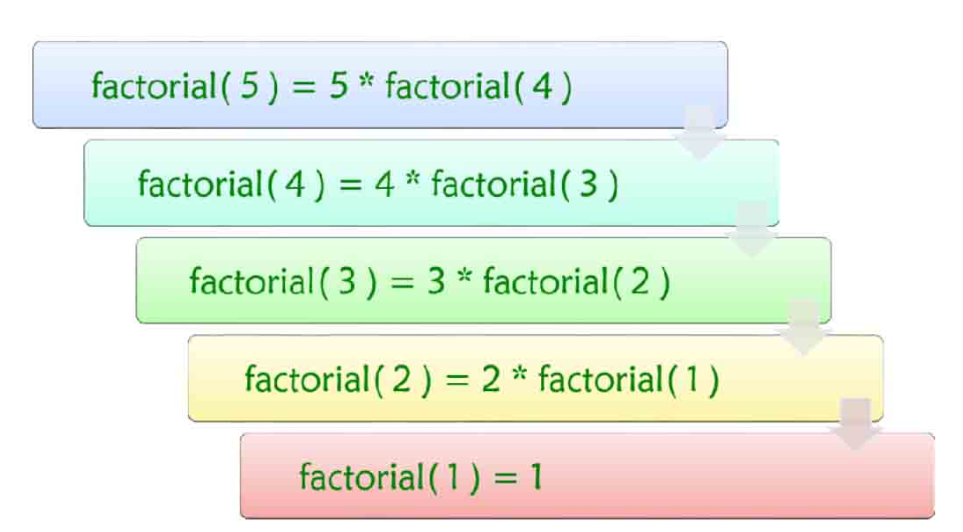

## Python的内建方法
```python
a=list([iterable])  # 将一个可迭代对象转换成列表,转换后是新的对象 
b=tuple([iterable]) # 将一个可迭代对象转换成元组 
c=str(obj)  #将对象转换成字符串 d=len(sub) # 返回sub参数的长度


sum(iterable[,start])  # 返回序列 iterable 的所有元素的总和 ，start参数默认是 0

sorted(iterable,key=None,reverse=False) # 使用方法与列表的内建方法sort()一致，但返回排序后的新列表,而不影响原列表

reversed(sequence) #列表的内建方法是原地翻转，而reversed()是返回一个翻转后的迭代器对象。你没看错，它不是返回一个列表，而是返回一个迭代器对象。
list1=[1,18,13,0,-98] 
reversed(list1) 
<list_reverseiterator object at 0x00000288185904F0> 
for each in reversed(list1): 
...     print(each,end=',') 
...     -98,0,13,18,1,

enumerate(iterable) # 生成由二元组构成的一个迭代对象，每个二元组由可迭代参数的索引号以及对应的元素组成。
str1='Fishc'
for each in enumerate(str1): 
...     print(each) 
...     (0, 'F') (1, 'i') (2, 's') (3, 'h') (4, 'c')

zip（）# zip（）方法用于返回由各个可迭代参数共同组成的元组
list1=[1,3,5,7,9] 
str1='Fishc' 
for each in zip(list1,str1): 
...     print(each) 
...     (1, 'F') (3, 'i') (5, 's') (7, 'h') (9, 'c')
```
## 函数的参数和返回值
```python
# 如果返回多个值，默认是以元组形式打包 
def duo_ge_zhi(): 
... return 1,2,3,'what' 

duo_ge_zhi() 
...(1, 2, 3, 'what')

# 关键字参数：在传入参数时明确指定形参的变量名，就可以不分位置。
def eat(body,thing):
    print('%s 把 %s 吃了'%(body,thing))

eat('小王','蛋糕')
小王 把 蛋糕 吃了
eat(thing='面包',body='小李')
小李 把 面包 吃了

# 默认参数：为参数指定默认的值
def helloWorld(name='徐二',word='HelloWord'):
    print('%s说%s'%(name,word))

helloWorld()
徐二说HelloWord

#在定义函数的时候，位置参数必须在默认参数的前面

# 可变参数：函数也不知道调用者实际上会传入多少个参数。 ` 是将参数打包成元组，** 是打包成字典。
def test(*p)
    print('有%d个参数'%len(p))
    print('第二个参数是：',p[1])

# 如果定义的函数中带有可变参数，那么可将其他参数设置为默认参数。否则在调用时，Python都会把参数算在可变参数中，引发报错。
print(*objects,sep='',end='\n',file=sys.stdout,flush=False)
```

## 函数的变量作用域
```python
# 函数内部只能访问局部变量，而不能改写全局变量。除非给变量加上global关键字。
count=5
def myFun():
    global count
    count=10
    print(count)

myFun()
10

# 函数里面可以内嵌函数
def fun1():
    print('fun1正在被调用')
    def fun2():
        print('fun2正在被调用')
    fun2()

fun1()
fun1正在被调用
fun2正在被调用

# 名字一样、作用域不同的变量引用，Python引入了LEGB原则进行规范。
# Local:函数内的名字空间
# Enclosing function locals：嵌套函数中外部函数的名字空间
# Global：函数定义所在模块的名字空间
# Builtin：Python内置模块的名字空间

# 闭包：内部函数保存外部函数的变量引用
# 什么是闭包？一个持有外部环境变量的函数就是闭包,即“封闭外部状态”。一个函数怎么才叫“能封闭外部状态”呢？当外部状态的scope失效的时候，还还有一份留在内部状态里面。有3个关键点来理解：
# 1.函数:funY  2.自由变量:y 3.环境:x
def funX(x):
    def funY(y):
        return x*y # funY里引用了外部函数funX的变量x
    return funY

temp=funX(8)
temp(5)
40

# 在内部函数中，只能对外部函数的局部变量进行访问，但不能修改。在函数中，只能对全局变量进行访问，但不能进行修改。

#内部函数访问外部函数的变量，但不能修改
def funX():
    x=5
    def funY():
        x=x+1 # 当要修改的时候，Python认为在内部函数的x是内部函数的局部变量，外部函数的x就被屏蔽了，所以找不到x变量的值就报错。
        return x
    return funY()

temp=funX()
temp()

error:local varibale 'x' referenced before assignment

# 可以使用nonlocal关键字告诉Python这不是局部变量
def funX():
    x=5
    def funY():
        nolocal x
        x=x+1
        return x
    return funY

temp=funX()
temp()

6
```

## 函数的装饰器
```
@buffer
@performance
@log
def eat(name):
    print('%s 开始吃了'%name)

# 调用eat()的时候，相当于调用buffer(performance(log(eat)))
# @a funb()类似于在a函数的环境下执行b函数的功能。有点接近闭包的概念。
```
## lambda 表达式
```python
# lambda x:2*x+1 左侧为参数，右侧为返回值，lambda表达式返回的是一个函数对象

g=lambda x,y:x+y
g(3,4)

7
```

## filter()内置函数
```python
# filter(function or None,iterable)
当第一个参数为None时，筛选出第二个参数里面为True的项目
当第一个参数为函数时，用第二个参数里面每一个项目执行函数，筛选出返回结果为True的项目。

def odd(x):
    return x%2

temp=filter(odd,range(10))
list(temp)
[1,3,5,7,9]

# lambda写法

list(filter(lambda x:x%2,range(10)))
[1,3,5,7,9]

```

## map()内置函数
```python
# map()会从所有可迭代对象中依次取一个元素组成一个元组，然后将元组传递给func。注意：如果可迭代对象的长度不一致，则以较短的迭代结束为止。
tuple(map(lambda x,y:x+y,[1,3,5,7,9],[1,2,3]))

(2, 5, 8)
```

## 递归
```python
# 求阶乘
def f(n):
    if n==1:
        return 1
    else:
        return n*f(n-1)
    
result=f(5)
```



